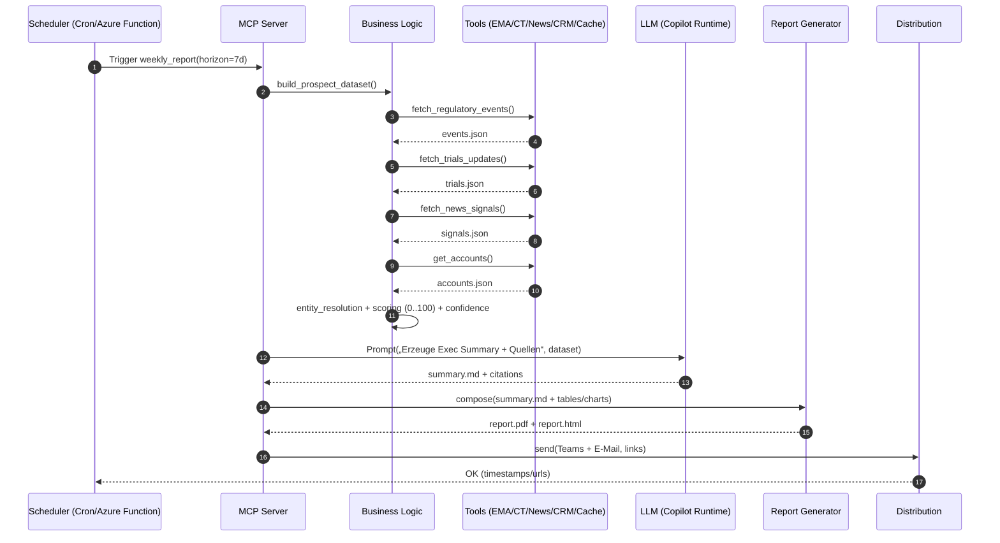

# MCP-Architektur für Recherche-Agent & Weekly Report

Diese Datei enthält drei Mermaid-Diagramme (Flow, Komponenten, Sequenz) sowie Beispiel-Tool-Schemas, Scoring-Formel und Betriebsaspekte für eine schlanke MCP-basierte Umsetzung.

> Hinweis: Renderbar in Viewern mit Mermaid-Unterstützung (z. B. GitHub, Obsidian, VS Code + Mermaid-Extension).

---

## 1) High‑Level Datenfluss (End‑to‑End)

```mermaid
flowchart LR
    subgraph User["User (Research / Management)"]
      U1[Chat in Copilot/LLM UI]
      U2[Scheduled Weekly Report]
    end

    subgraph LLM["Copilot / LLM Runtime"]
      P[Policy/Guardrails]
      A[Agent / Orchestrator]
      Cx[Context Manager]
    end

    subgraph MCP["MCP Server"]
      R[Router]
      S[Schema Registry<br/>(Tool & Resource Specs)]
      B[Business Logic<br/>(Scoring/Enrichment)]
    end

    subgraph Tools["MCP Tools (Datenquellen)"]
      T1[Handelsregister Tool]
      T2[Regulatory Tool<br/>(EMA/FDA/PMDA)]
      T3[ClinicalTrials Tool]
      T4[News/PR Tool]
      T5[CRM/Accounts Tool]
      T6[Cache/Storage Tool<br/>(SQLite/Blob/Vector)]
    end

    subgraph Reporting["Reporting & Distribution"]
      PBI[Report Generator<br/>(Markdown/HTML→PDF)]
      DIST[Distribution<br/>(E-Mail/Teams/SharePoint)]
      STORE[Report Store<br/>(Blob/SharePoint)]
    end

    U1 -->|Query/Task| P --> A --> Cx
    Cx -->|Tool Calls (MCP)| R
    R --> S
    R --> B
    R --> T1 & T2 & T3 & T4 & T5 & T6

    T1 --> R
    T2 --> R
    T3 --> R
    T4 --> R
    T5 --> R
    T6 --> R

    R --> Cx
    Cx --> A -->|Grounded Answer + Quellen| U1

    U2 -->|Scheduler Trigger| B
    B -->|Weekly KPI JSON| PBI --> STORE --> DIST
```

---

## 2) Komponenten‑Diagramm (Deploy‑Sicht)

```mermaid
graph TB
  subgraph Client["Client / UX"]
    COP[Copilot Studio / Chat UI]
  end

  subgraph Runtime["LLM Runtime"]
    AG[Agent (Tool-Use + Planning)]
    POL[Guardrails / Content Safety]
    MEM[Short-term Context / Memory]
  end

  subgraph Infra["MCP Server (Container/App Service)"]
    API[MCP API (WebSocket/HTTP)]
    REG[Tool Schema Registry]
    LOG[Obs/Logging/Tracing]
    BIZ[Business Layer (Scoring, Aggregation)]
  end

  subgraph Connectors["MCP Tools/Connectors"]
    HRZ[Handelsregister Connector]
    REGU[Regulatory Connector (EMA/FDA)]
    CTG[ClinicalTrials Connector]
    NEWS[News/PR/RSS Connector]
    CRM[CRM/Accounts Connector]
    CACH[Cache/DB (SQLite/Redis/Blob)]
    VEC[Vector Index (FAISS/SQLite-VSS)]
  end

  subgraph Reporting["Reporting Pipeline"]
    GEN[Report Generator (LLM-Narrative)]
    PDF[Renderer (HTML→PDF)]
    DIST[Distribution (E-Mail/Teams)]
    STORE[Report Storage]
  end

  COP --> AG
  AG --> POL
  AG --> MEM
  AG -- MCP Calls --> API
  API --> REG
  API --> LOG
  API --> BIZ
  BIZ --> HRZ & REGU & CTG & NEWS & CRM & CACH & VEC
  BIZ --> GEN
  GEN --> PDF --> STORE --> DIST
```

---

## 3) Sequenzdiagramm (Beispiel: „Wöchentlicher Report“)



---

## 4) Tool‑Definitionen (MCP Schemas – Beispiel)

> Die Tools kapseln den Zugriff auf externe/ interne Quellen. Input/Output sind strikt JSON.

```json
[
  {
    "name": "get_regulatory_events",
    "description": "Regulatorische Meilensteine (EMA/FDA etc.) zu Produkten/Indikationen",
    "input_schema": {
      "type": "object",
      "properties": {
        "product": {"type":"string"},
        "company": {"type":"string"},
        "region": {"type":"string", "enum":["EU","US","JP","CN","GLOBAL"]},
        "horizon_days": {"type":"integer", "default": 60}
      }
    }
  },
  {
    "name": "get_trials",
    "description": "ClinicalTrials Updates nach Firma/Produkt/Phase",
    "input_schema": {
      "type": "object",
      "properties": {
        "company": {"type":"string"},
        "product": {"type":"string"},
        "phase": {"type":"string", "enum":["I","II","III","IV"]},
        "updated_since": {"type":"string", "format":"date"}
      }
    }
  },
  {
    "name": "get_market_signals",
    "description": "News/PR/Hiring/Partnering als Launch- und Expansion-Signale",
    "input_schema": {
      "type":"object",
      "properties":{
        "company":{"type":"string"},
        "countries":{"type":"array","items":{"type":"string"}}
      }
    }
  },
  {
    "name": "get_company_registry",
    "description": "Firmendaten aus Handelsregister/LEI/ISIN",
    "input_schema": {
      "type":"object",
      "properties":{
        "query":{"type":"string"},
        "country":{"type":"string"}
      }
    }
  },
  {
    "name":"score_prospects",
    "description":"Berechnet Score (0-100) je Unternehmen basierend auf Features",
    "input_schema":{
      "type":"object",
      "properties":{
        "features":{"type":"array","items":{"type":"object"}}
      }
    }
  },
  {
    "name":"render_report",
    "description":"Rendert Markdown/HTML zu PDF und speichert Artefakte",
    "input_schema":{
      "type":"object",
      "properties":{
        "markdown":{"type":"string"},
        "assets":{"type":"array","items":{"type":"string"}},
        "store":{"type":"string","enum":["blob","sharepoint","local"]},
        "path":{"type":"string"}
      }
    }
  }
]
```

---

## 5) Scoring‑Formel (leichtgewichtig im MCP‑Server)

```text
score = 100 * (
  0.40 * phase_score +
  0.30 * regulatory_proximity +
  0.20 * market_activity +
  0.10 * confidence
)

phase_score: I=0.2, II=0.5, III=0.8, Submission=0.9, Approved=1.0
regulatory_proximity: Funktion von PDUFA/CHMP ETA & Priority-Tags
market_activity: gewichtete Signale (Partnering, Hiring, Distributoren)
confidence: #Quellen * Aktualität * Datenqualität
```

---

## 6) Sicherheits‑ & Betriebsaspekte
- **Guardrails/Policies** im LLM‑Layer (No‑Answer bei Unsicherheit, Quellenpflicht).
- **Credential Handling**: Secrets via Key Vault/Env Vars; Least Privilege.
- **Caching**: Response‑Cache (SQLite/Redis) + Mini‑Vector‑Index (FAISS/SQLite‑VSS) für Textpassagen.
- **Observability**: strukturierte Logs (Tool‑Calls, Dauer, Kosten), Korrelation‑ID.
- **Legal**: API‑Terms, Urheberrechte, DSGVO (PII vermeiden), Robots.txt beachten.

---

## 7) Nächste Schritte
1. Tool‑Schemas finalisieren und in MCP registrieren.
2. 2–3 Datenquellen als MVP anbinden (z. B. EMA, ClinicalTrials, Firmen‑PR).
3. Business‑Scoring im MCP‑Server implementieren.
4. Scheduled „weekly_report“ Workflow + PDF‑Render aufsetzen.

